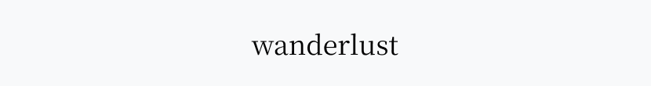
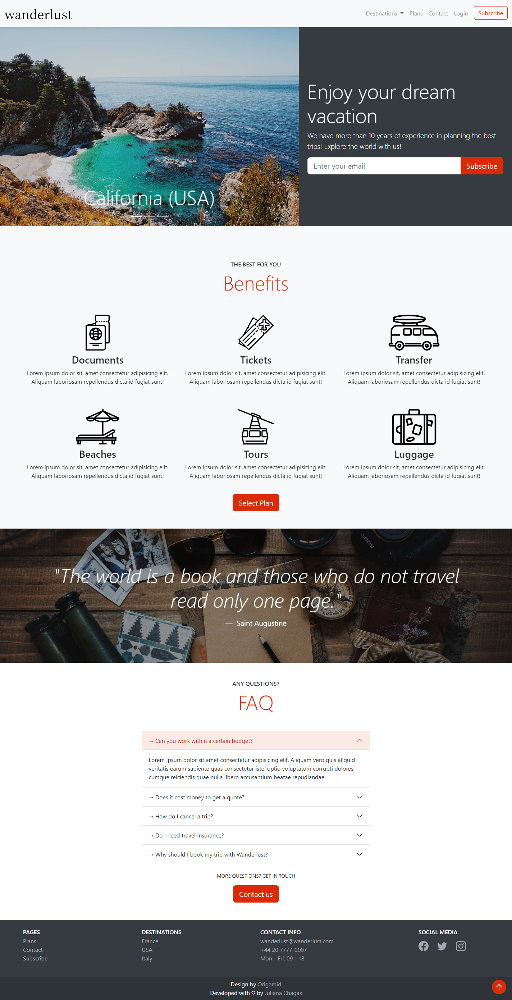
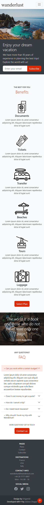

<br>

# Wanderlust Website ✈️

This project is a website of a fictional travel agency called Wanderlust. It was developed to practice SASS, Bootstrap 5, and JavaScript.

The website consists of the main page (home) and four subpages: destination, plans, contact, and subscribe. The navigation and footer are present on all the website pages.

- Homepage: four main sections: hero, benefits, quote, and frequently asked questions (FAQ);

- Destination: image grid and a table with the upcoming events;

- Plans: subscription plans offered by the travel agency;

- Contact: contact form, embed Google Maps, contact details (email, phone, and social media links), and FAQ;

- Subscribe: payment form with two payment methods options: credit card and bank transfer;

Bootstrap's source Saas files were used to customize the project: to override color variables' default values and add new colors to the `$theme-colors` map. Webpack was used to bundle Sass and JavaScript.

<p align="center">
 <a href="#technologies">Technologies</a> •
 <a href="#dependencies">Dependencies</a> • 
 <a href="#link">Live Site URL</a> • 
 <a href="#layout">Layout</a> • 
 <a href="#use">How to use</a> • 
 <a href="#resources">Resources</a> • 
 <a href="#author">Author</a> •
 <a href="#license">License</a>
</p>

<h2 id="technologies">🛠️ Technologies </h2>

- HTML
- CSS/SASS
- JavaScript
- Bootstrap 5
- Webpack

<h2 id="dependencies">🧰 Dependencies </h2>

- [Bootstrap 5](https://getbootstrap.com/)
- [Popper JS](https://popper.js.org/)
- [ScrollReveal](https://scrollrevealjs.org/)

<h2 id="link">🔗 Link</h2>

- [Live Site URL](https://julianachagas.github.io/wanderlust-website/)

<h2 id="layout">🖥️ Layout</h2>

- Homepage: Web 💻

 <br/><br/>

- Homepage: Mobile 📱

 <br/><br/>

<h2 id="use">⚙️ How to use</h2>

To clone and run this project you'll need [Node.js](https://nodejs.org/en/), [Git](https://git-scm.com), and a code editor like [VSCode](https://code.visualstudio.com/) installed on your computer. Follow the instructions bellow:

```bash
# Clone this repository
$ git clone https://github.com/julianachagas/wanderlust-website.git

# Go into the repository
$ cd wanderlust-website

# Install the dependencies
$ npm install

# Run the website in development mode (webpack dev server)
# Open http://localhost:3000 to view it in your browser
$ npm run start

# Build the website for production to the dist folder
$ npm run build
```

<h2 id="resources">💡 Resources</h2>

- Website design by [Origamid](https://www.origamid.com/projetos/caravan/)

<h2 id="author">👩🏻‍💻 Author</h2>

Get in touch: <br>
<a href="https://www.linkedin.com/in/juliana--chagas/" target="_blank"></a>
<a href="https://twitter.com/JulianaCoding" target="_blank"></a>

<h2 id="license">📝 License</h2>


<br>

---

##### Made with 💜 by Juliana Chagas
